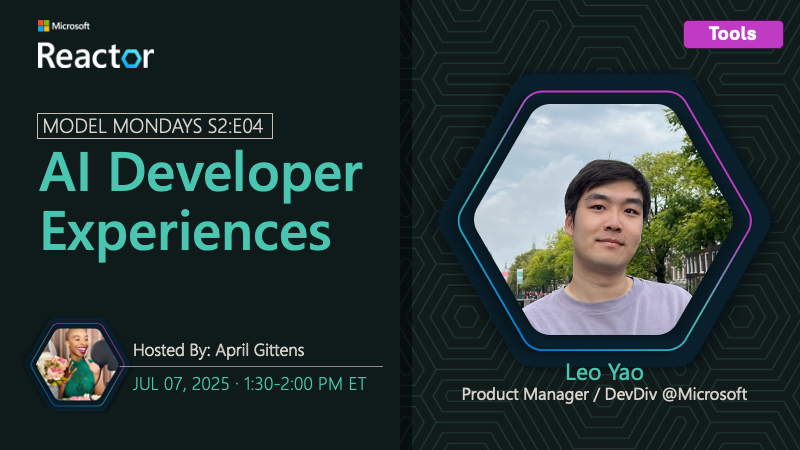

---
date:
    created: 2025-07-07
draft:
    true
authors:
  - sharda
categories:
  - Recaps
  - Season-02
tags:
  - ai, developer, vscode, toolkit
---
 
# S2:E4 Understanding AI Developer Experiences with Leo Yao
 
> Model Mondays is a weekly series to build your Azure AI Foundry Model IQ. In this episode, we focus on the AI Developer Experience—streamlining the journey from model selection to deployment using the AI Toolkit and Azure AI Foundry extensions for Visual Studio Code.
 
_This week in Model Mondays, we spotlight the tools and workflows that make building generative AI apps and agents easier for developers. Read on for my recap!_
 

 
 
 
### About Model Mondays
 
Model Mondays is a weekly series designed to help you build your Azure AI Foundry Model IQ step by step. Here’s how it works:
 
- 5-Minute Highlights – Quick news and updates about Azure AI models and tools on Monday
- 15-Minute Spotlight – Deep dive into a key model, protocol, or feature on Monday
- 30-Minute AMA on Friday – Live Q&A with subject matter experts from Monday livestream
 
If you want to grow your skills with the latest in AI model development, [Model Mondays](https://aka.ms/model-mondays) is the place to start. Want to follow along?
 
- [Register Here](https://developer.microsoft.com/en-us/reactor/series/S-1485/?wt.mc_id=studentamb_263805) - to watch upcoming Model Monday livestreams
- [Watch Playlists](https://aka.ms/model-mondays/playlist) to replay past Model Monday episodes
- [Register Here](https://discord.com/invite/azureaifoundry?event=1382861578201858058?wt.mc_id=studentamb_263805) - to join the AMA on AI Developer Experiences
- [Visit The Forum](https://aka.ms/model-mondays/forum) - to view Foundry Friday AMAs and recaps
 
 
 
## Spotlight On: AI Developer Experiences
 
### 1. What is this topic and why is it important?
 
AI Developer Experiences are all about making the process of building, testing, and deploying AI models as smooth as possible. With the right tools—like the AI Toolkit and Azure AI Foundry extensions for VS Code—developers can focus on innovation instead of setup hassles. This is crucial for accelerating the adoption of generative AI in real-world applications.
 
### 2. What is one key takeaway from the episode?
 
The integration of Azure AI Foundry with VS Code means you can manage models, run experiments, and deploy apps—all from your favorite editor. This unified workflow saves time and reduces friction for developers.
 
### 3. How can I get started?
 
- Install the [AI Toolkit for VS Code](https://marketplace.visualstudio.com/items?itemName=ms-ai-foundry.ai-toolkit)
- Explore the [Azure AI Foundry documentation](https://learn.microsoft.com/en-us/azure/developer/azure-ai-foundry/overview)
- Try out the sample projects and experiment with deploying your own models
 
### 4. What's new in Azure AI Foundry?
 
 
Here are some of the latest updates in Azure AI Foundry:
 
- **AI Toolkit for VS Code**: Now with even tighter integration, making it easier to manage models, run experiments, and deploy apps directly from your editor.
- **Prompt Shields**: Enhanced security features to help protect your apps from prompt injection and unsafe content.
- **Model Router**: A new feature that intelligently routes requests to the best available model for your needs, improving efficiency and performance.
- **Expanded Model Catalog**: More open-source and proprietary models are now available, including the latest from Hugging Face and OpenAI.
- **Improved Documentation & Samples**: New guides and sample projects to help you get started faster and build with confidence.
 
 
 
 
## My A-Ha Moment
 
Honestly, before this episode, I always felt a bit overwhelmed by the idea of setting up a full AI dev environment. There were so many tools, steps, and things that could go wrong. But seeing the AI Toolkit in action inside VS Code totally changed my perspective. It was like, “Wait, that’s it? I can just click around, try out models, and deploy stuff without leaving my editor?”
 
It made me realize that building with AI doesn’t have to be complicated or intimidating. Sometimes, the right tools really do make all the difference. Now, I’m actually excited to experiment and build new things—because it finally feels accessible and fun.
 
 
 
## Coming Up Next Week:
Next week, we dive into Fine Tuning & Distillation with Dave Voutila. We’ll explore how to customize Azure OpenAI models for your own applications and best practices for efficient knowledge transfer. [Register Here!](https://aka.ms/model-mondays/rsvp)
 

 
 
 
## Join The Community
Great devs don't build alone! In a fast-paced developer ecosystem, there's no time to hunt for help. That's why we have the Azure AI Developer Community. Join us today and let's journey together!
 
1. [Join the Discord](https://discord.com/invite/QR3kaErCRx?wt.mc_id=studentamb_263805) - for real-time chats, events & learning
2. [Explore the Forum](https://github.com/orgs/azure-ai-foundry/discussions/55?wt.mc_id=studentamb_263805) - for AMA recaps, Q&A, and help!
 
 
 
## About Me:
I'm Sharda, a Gold Microsoft Learn Student Ambassador interested in cloud and AI. Connect with me here:
 
- [LinkedIn](https://www.linkedin.com/in/sharda-kaur-a77473207/)
- [GitHub](https://github.com/shardakaurr)
- [Dev.to](https://dev.to/sharda_kaur)
- [Tech Community](https://techcommunity.microsoft.com/users/sharda_kaur/2204790)