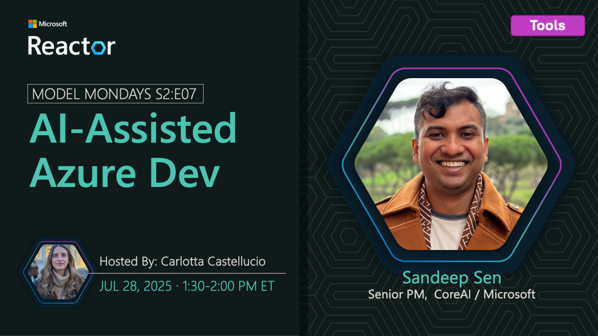

---
date:
    created: 2025-07-21
draft: false
authors: 
  - sharda
  - nitya
categories:
  - Recaps
  - Season-02
tags:
  - research, innovation, mcp-server, magentic-ui
---

# S2:E6 Understanding Research & Innovation with SeokJin Han and Saumil Shrivastava

> Model Mondays is a weekly series to build your Azure AI Foundry Model IQ. In this episode, we focus on Research & Innovation — and learn how Azure AI Foundry Labs serves as a hub to explore cutting-edge research from Microsoft.

_This week in Model Mondays, we focus on Research & Innovation — and learn how Azure AI Foundry Labs serves as a hub to explore cutting-edge research from Microsoft. Read on for my recap of SeokJin Han and Saumil Shrivastava's insights on two key projects — the MCP Server for Azure AI Foundry, and the Magentic-UI for advancing research on human-in-the-loop experiences with AI._

 

### About Model Mondays

Model Mondays is a weekly series designed to help you build your Azure AI Foundry Model IQ step by step. Here's how it works:

- 5-Minute Highlights – Quick news and updates about Azure AI models and tools on Monday
- 15-Minute Spotlight – Deep dive into a key model, protocol, or feature on Monday
- 30-Minute AMA on Friday – Live Q&A with subject matter experts from Monday livestream

If you want to grow your skills with the latest in AI model development, [Model Mondays](https://aka.ms/model-mondays) is the place to start. Want to follow along?

- [Register Here](https://developer.microsoft.com/en-us/reactor/series/S-1485/?wt.mc_id=studentamb_263805) - to watch upcoming Model Monday livestreams 
- [Watch Playlists](https://aka.ms/model-mondays/playlist) to replay past Model Monday episodes 
- [Register Here](https://discord.gg/D7bAFEwj?event=1382862595849064548?wt.mc_id=studentamb_263805) - to join the AMA on Research & Innovation on Friday Jul 25
- [Visit The Forum](https://aka.ms/model-mondays/forum?wt.mc_id=studentamb_263805) - to view Foundry Friday AMAs and recaps

 

## Spotlight On: Research & Innovation

### 1. What is this topic and why is it important?

Azure AI Foundry Labs represents Microsoft's commitment to bridging the gap between cutting-edge research and practical applications. It's a space where experimental projects can be explored, tested, and potentially integrated into production-ready tools. The two featured projects — the MCP Server for Azure AI Foundry and Magentic-UI — showcase how research innovations can directly enhance developer productivity and user experiences.

This is important because it demonstrates how research doesn't happen in isolation but actively feeds into the tools and platforms that developers use every day. It's the innovation pipeline that keeps Azure AI Foundry at the forefront of AI development.

### 2. What is one key takeaway from the episode?

The key insight is that the best research projects are those that solve real developer problems while pushing the boundaries of what's possible. The MCP Server enables seamless integration between AI models and Azure services, while Magentic-UI explores new paradigms for human-AI collaboration. Both projects show how research can be both innovative and immediately useful.

### 3. How can I get started?

To explore research and innovation opportunities:
1. Visit Azure AI Foundry Labs to discover experimental projects
2. Try out the MCP Server for Azure AI Foundry in your own projects
3. Experiment with Magentic-UI for human-in-the-loop AI experiences
4. Contribute to open-source research projects
5. Join the research community discussions and provide feedback

### 4. What's new in Azure AI Foundry?

[This section will be filled in later]

 

## My A-Ha Moment

My biggest realization from this episode was understanding that research in AI isn't just about publishing papers or creating impressive demos — it's about solving real problems that developers face every day. When I heard about the MCP Server project, I realized how it directly addresses the challenge of connecting AI models to actual business systems and data sources.

Similarly, the Magentic-UI project opened my eyes to the future of human-AI collaboration. Instead of just using AI as a black box, we're moving toward interfaces where humans and AI can work together more intuitively. It made me think about all the times I've struggled with AI tools because the interaction model wasn't quite right.

The most exciting part is that these aren't just research concepts — they're projects I can actually try and use in my own work. It's like getting a sneak peek into the future of AI development tools.

 

## Coming up Next Week

Next week, we dive into Model Auto-Selection. We'll explore what happens when your model selection is made for you automatically, based on factors like query complexity, cost & performance. We'll discuss Model Router — a deployable chat model that acts like a multi-model proxy, intelligently routing requests to the best available model in real time, based on a given prompt. [Register Here!](https://aka.ms/model-mondays/rsvp)

 

## Join The Community
Great devs don't build alone! In a fast-paced developer ecosystem, there's no time to hunt for help. That's why we have the Azure AI Developer Community. Join us today and let's journey together!

1. [Join the Discord](https://discord.com/invite/QR3kaErCRx?wt.mc_id=studentamb_263805) - for real-time chats, events & learning
2. [Explore the Forum](https://aka.ms/model-mondays/forum?wt.mc_id=studentamb_263805) - for AMA recaps, Q&A, and help!

 
 
## About Me:
I'm Sharda, a Gold Microsoft Learn Student Ambassador interested in cloud and AI. Find me on Github, Dev.to, Tech Community and Linkedin. In this blog series I have summarized my takeaways from this week's Model Mondays livestream.
