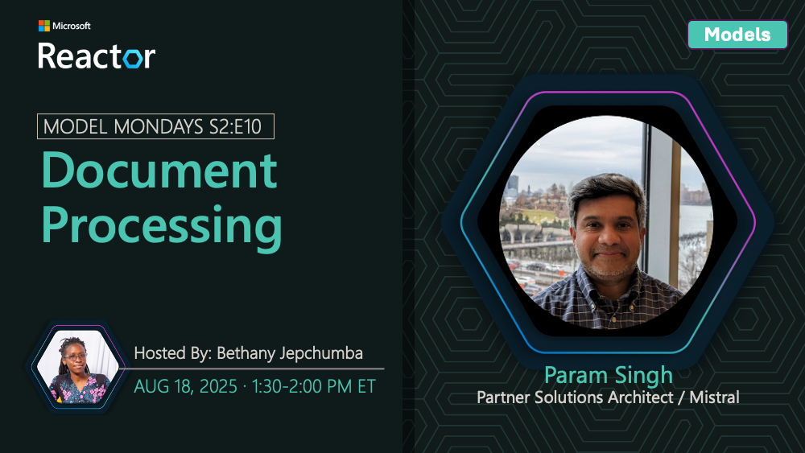

---
date:
    created: 2025-08-18
draft: false
authors: 
  - sharda
  - nitya
categories:
  - Recaps
  - Season-02
tags:
  - image-generation, video-generation, sora, gpt-image-1
---

# S2:E10 Understanding Image & Video Playgrounds with Thasmika Gokal

> Model Mondays is a weekly series to build your Azure AI Foundry Model IQ. In this episode, we focus on Image & Video Playgrounds — and learn about high-fidelity testbeds to prototype visual and video-based generative AI apps with cutting-edge models.

_This week in Model Mondays, we focus on Image & Video Playgrounds — and learn about high-fidelity testbeds to prototype visual and video-based generative AI apps with cutting-edge models like Sora and GPT-image-1. Read on for my recap of Thasmika Gokal's insights on going from prompt to playback with Azure AI Foundry Image & Video Playgrounds._

 

### About Model Mondays

Model Mondays is a weekly series designed to help you build your Azure AI Foundry Model IQ step by step. Here's how it works:

- 5-Minute Highlights – Quick news and updates about Azure AI models and tools on Monday
- 15-Minute Spotlight – Deep dive into a key model, protocol, or feature on Monday
- 30-Minute AMA on Friday – Live Q&A with subject matter experts from Monday livestream

If you want to grow your skills with the latest in AI model development, [Model Mondays](https://aka.ms/model-mondays) is the place to start. Want to follow along?

- [Register Here](https://developer.microsoft.com/en-us/reactor/series/S-1485/?wt.mc_id=studentamb_263805) - to watch upcoming Model Monday livestreams 
- [Watch Playlists](https://aka.ms/model-mondays/playlist) to replay past Model Monday episodes 
- [Register Here](https://discord.gg/azureaifoundry?event=1382864122902745228?wt.mc_id=studentamb_263805) - to join the AMA on Image & Video Playgrounds on Friday Aug 22
- [Visit The Forum](https://aka.ms/model-mondays/forum?wt.mc_id=studentamb_263805) - to view Foundry Friday AMAs and recaps

 

## Spotlight On: Image & Video Playgrounds

### 1. What is this topic and why is it important?

Image & Video Playgrounds in Azure AI Foundry provide high-fidelity testbeds for experimenting with cutting-edge visual generative AI models like Sora and GPT-image-1. These playgrounds enable developers to quickly prototype, test, and iterate on visual content generation without the complexity of setting up inference pipelines or managing model deployments.

This is crucial because visual AI is rapidly evolving, and having accessible environments to experiment with the latest models accelerates innovation. The playgrounds bridge the gap between research capabilities and practical application development, making advanced visual AI accessible to a broader range of developers.

### 2. What is one key takeaway from the episode?

The key insight is that visual AI development benefits tremendously from rapid experimentation and iteration. The Image & Video Playgrounds provide immediate feedback loops that allow developers to understand model capabilities, refine prompts, and explore creative possibilities before committing to production implementations.

### 3. How can I get started?

To get started with Image & Video Playgrounds:
1. Access the Image & Video Playgrounds in Azure AI Foundry
2. Experiment with different models like Sora for video and GPT-image-1 for images
3. Practice prompt engineering for visual content generation
4. Test various parameters and settings to understand model behavior
5. Use the playground outputs to prototype user experiences and workflows

### 4. What's new in Azure AI Foundry?

[This section will be filled in later]

 

## My A-Ha Moment

My biggest revelation was understanding how dramatically visual AI has evolved and how accessible it has become through these playgrounds. I used to think that generating high-quality images and videos required deep technical expertise and significant infrastructure setup. But seeing the Image & Video Playgrounds in action showed me that we're now at a point where creating professional-quality visual content is as simple as writing a good prompt.

What really struck me was the immediate feedback loop — being able to see results instantly, iterate on prompts, and experiment with different approaches in real-time. It's like having a creative studio where you can explore ideas without the traditional barriers of time, cost, or technical complexity.

The most exciting realization was that this technology opens up entirely new possibilities for applications I'm building. Instead of just using stock images or simple graphics, I can now generate custom visuals that perfectly match my specific needs and brand requirements.

 

## Coming up Next Week

Next week, we dive into Text & Speech Playgrounds with Cenyu Zhang. We'll explore natural language and speech capabilities (like text to speech, speech to text, translation etc.) in your browser before switching to code. Learn about the Azure AI Foundry Speech and Language playground and how we can use Speech resources to transform the user experience in generative AI applications. [Register Here!](https://aka.ms/model-mondays/rsvp)

 

## Join The Community
Great devs don't build alone! In a fast-paced developer ecosystem, there's no time to hunt for help. That's why we have the Azure AI Developer Community. Join us today and let's journey together!

1. [Join the Discord](https://discord.com/invite/QR3kaErCRx?wt.mc_id=studentamb_263805) - for real-time chats, events & learning
2. [Explore the Forum](https://aka.ms/model-mondays/forum?wt.mc_id=studentamb_263805) - for AMA recaps, Q&A, and help!

 
 
## About Me:
I'm Sharda, a Gold Microsoft Learn Student Ambassador interested in cloud and AI. Find me on Github, Dev.to, Tech Community and Linkedin. In this blog series I have summarized my takeaways from this week's Model Mondays livestream.
